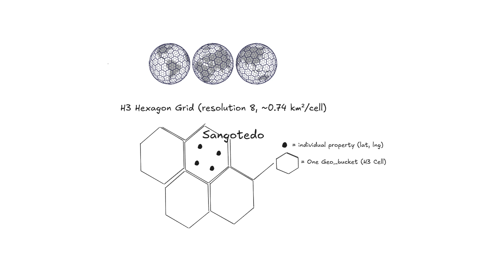
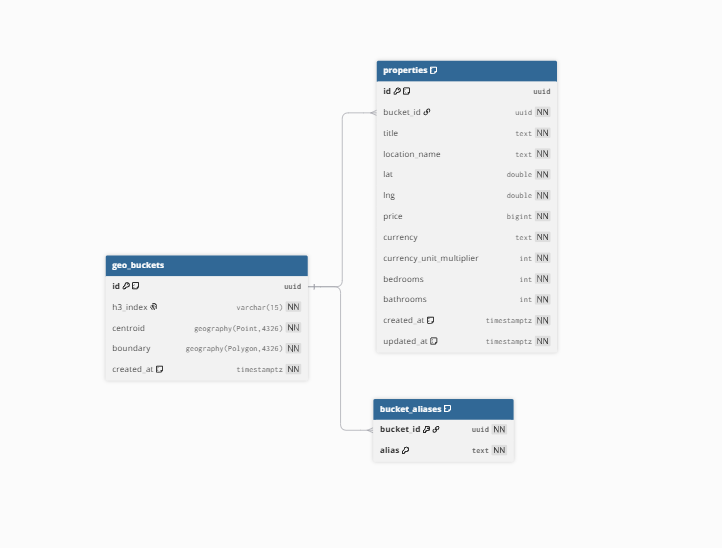
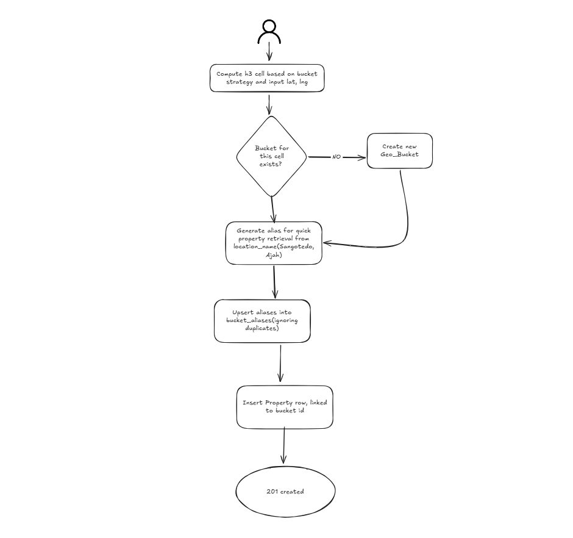
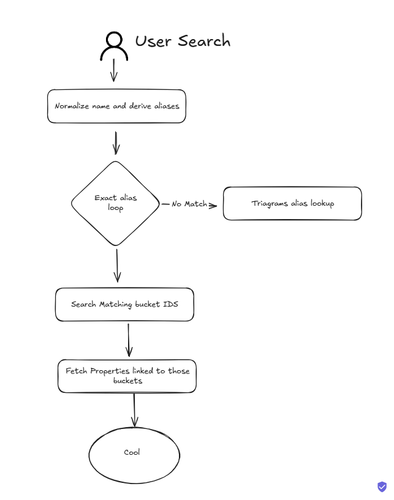

# Geo-spatial Property Indexing and Retrieval

The goal is to return properties in the same area even when users write the
location differently. We combine geographic grouping with location aliases:
coordinates determine the bucket, while names help users find it.

The stack is FastAPI, SQLAlchemy, PostgreSQL with PostGIS, H3, and `pg_trgm`.
Alembic manages the database schema. Setup commands are in [README.md](README.md).

## Assumptions

- The initial use case is neighbourhood searches in Lagos.
- Users supply coordinates; we do not verify them through an external geocoder.
- A neighbourhood can span several buckets, and a bucket can overlap named areas.
- The API accepts an integer price in kobo. Currency `NGN` and multiplier `100`
  are assigned internally.
- City-wide searches and official neighbourhood boundaries are outside this version.

## Geo-Bucket Strategy

We use **H3 resolution 8**. H3 divides the map into cells, mostly hexagons, with
an average hexagon area of approximately **0.74 km²** at this resolution.
Actual cell areas vary.

Each property's latitude and longitude produce an H3 cell ID. Properties with
the same cell ID share a bucket. If that bucket does not exist, we create it.
The bucket stores the H3 cell's centre and boundary, not the first property's
coordinates.

There is no extra radius or distance threshold. Assignment follows the grid and
does not depend on which property was added first. Two nearby properties can
fall on opposite sides of a cell boundary; registering aliases in both buckets
lets the same neighbourhood search find them.

Resolution 8 gives us relatively small groups for neighbourhood searches without
needing a boundary dataset. It is an approximation, not an official definition
of a neighbourhood.

## Database Schema

| Table | Purpose |
| --- | --- |
| `geo_buckets` | Stores a UUID, unique H3 cell ID, centre, boundary, and creation time. |
| `properties` | Stores listing details, original location name, coordinates, price, rooms, timestamps, and `bucket_id`. |
| `bucket_aliases` | Links normalized location names to buckets. |

Each property belongs to one bucket through `properties.bucket_id`. Each bucket
can have many properties and aliases. The composite primary key
`(bucket_id, alias)` prevents duplicate aliases within a bucket while allowing
the same name across different buckets.

Foreign keys prevent references to missing buckets. Deleting an occupied bucket
is restricted; deleting an empty bucket removes its aliases.

### Indexes

| Index | Purpose |
| --- | --- |
| Unique `geo_buckets.h3_index` | Finds existing cells and prevents duplicate buckets. |
| GiST on bucket centre and boundary | Supports spatial queries on PostGIS geography values. |
| `properties(bucket_id, created_at, id)` | Supports property lookup by bucket. |
| B-tree on `bucket_aliases.alias` | Supports exact name lookup. |
| GIN on aliases with `gin_trgm_ops` | Supports typo-tolerant lookup. |

The centre and boundary use SRID 4326. Properties retain numeric latitude and
longitude; they do not currently have their own spatial point index.

## Location Matching Logic

We normalize names by applying Unicode normalization, ignoring case, replacing
punctuation with spaces, and collapsing repeated whitespace.

We save the normalized full name and a shorter alias after removing known
trailing qualifiers: `Ajah` and `Lagos`. Multiword names such as `Victoria Island`
stay intact.

| Input | Stored aliases |
| --- | --- |
| `Sangotedo` | `sangotedo` |
| `sangotedo` | `sangotedo` |
| `Sangotedo, Ajah` | `sangotedo ajah`, `sangotedo` |
| `sangotedo lagos` | `sangotedo lagos`, `sangotedo` |

Search uses the same normalization. It tries exact aliases first. If none match,
queries of at least three normalized characters use PostgreSQL trigram matching
with a threshold of **0.3**. This lets a typo such as `sangotdeo` find the seeded
Sangotedo properties. Shorter queries use exact matching only.

Matching aliases identify buckets, then the API retrieves properties through
their bucket IDs. It does not compare the search text against every property.
Multiple matching aliases do not duplicate a property in the results.

Searching `Lagos` alone does not automatically find every Lagos neighbourhood.
The system has aliases, not a city-to-neighbourhood hierarchy. Similarly, fuzzy
matching is a useful approximation and can produce false positives.

## Property Creation

`POST /api/properties` accepts `title`, `location_name`, `lat`, `lng`, `price`,
`bedrooms`, and `bathrooms`.

The route validates the input and calls the property repository. The repository
creates or finds the bucket, registers aliases, and inserts the property in
**one transaction**. A failure rolls back all of those writes.

Unique constraints and conflict handling prevent concurrent requests from
creating duplicate cells or aliases. Repeated POST requests still create
separate listings.

## Search Flow

`GET /api/properties/search?location=sangotedo`

Results include `items`, `total`, `limit`, and `offset`. The default page size
is 50, capped at 100, ordered by creation time and ID. No match returns an empty
list. All matching buckets are considered; we do not automatically add neighbours.

The required three inputs—`Sangotedo` at `(6.4698, 3.6285)`, `Sangotedo, Ajah`
at `(6.4720, 3.6301)`, and `sangotedo lagos` at `(6.4705, 3.6290)`—all register
`sangotedo`. Searching that name returns all three properties.

## Bucket Stats

`GET /api/geo-buckets/stats` returns total buckets, total properties, a page of
property counts per bucket, and coverage.

Coverage means the summed area of occupied H3 cells in km², together with the
bounding box of property coordinates. It is not building footprint area or an
official neighbourhood boundary. Empty data returns zero area and null bounds.

Counts are calculated from the tables rather than stored as counters. This keeps
writes simple, although exact totals and coverage become more expensive as data
grows. Separate stats queries can also see slightly different totals during
concurrent writes.

## Tests and Sample Data

Unit tests mock repository calls and verify API validation and responses.
Integration tests use Testcontainers with real PostGIS, apply migrations, and
exercise the API through TestClient.

They cover the three Sangotedo inputs, case differences, typos, unrelated areas,
adjacent cells, pagination, counts, foreign keys, and transaction rollback.
`seed.py` adds the three Sangotedo examples, Ikeja, and Victoria Island. Fixed
property IDs make it safe to rerun with `make seed`.

## Trade-offs and Scaling

At 500,000 properties, text matching still runs against aliases, and property
retrieval uses indexed bucket IDs. Indexes help, but response time still depends
on how many buckets and properties match. Exact counts and large offsets remain
costs. Measure representative queries before adding cached stats or cursor-based
pagination.

The main limitation is boundary accuracy: a matched cell can contain properties
labelled as another neighbourhood. With more time, named neighbourhood polygons
and a city hierarchy would support precise membership and broader searches.

Alternatives considered:

- **Radius searches:** PostGIS can perform indexed distance queries, but text
  searches still need a known coordinate and a rule for choosing the radius.
- **Administrative polygons:** clearer boundaries where reliable data exists,
  but informal neighbourhoods may not have published boundaries.
- **Larger H3 cells:** fewer buckets, but more unrelated areas grouped together.
